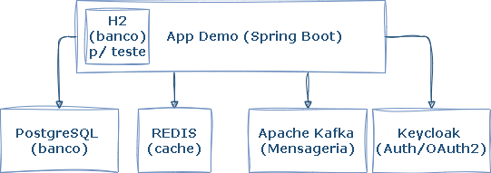
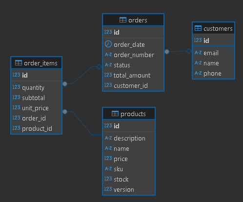
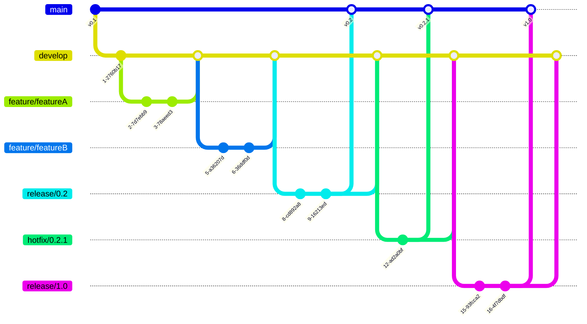

# 📘 App Demo ShowCase

[](https://github.com/ramiralvesmelo/app-demo/actions/workflows/maven.yml)
[](https://search.maven.org/artifact/org.springframework.boot/spring-boot-starter)
[](https://adoptium.net/)
[](https://spring.io/projects/spring-boot)
[](https://app.codecov.io/gh/ramiralvesmelo/app-demo)

[](https://sonarcloud.io/summary/new_code?id=ramiralvesmelo_app-demo)
[](https://sonarcloud.io/summary/new_code?id=ramiralvesmelo_app-demo)
[](https://sonarcloud.io/summary/new_code?id=ramiralvesmelo_app-demo)
[](https://sonarcloud.io/summary/new_code?id=ramiralvesmelo_app-demo)
[](https://sonarcloud.io/summary/new_code?id=ramiralvesmelo_app-demo)
[](https://sonarcloud.io/summary/new_code?id=ramiralvesmelo_app-demo)
[](https://sonarcloud.io/summary/new_code?id=ramiralvesmelo_app-demo)
[](https://sonarcloud.io/summary/new_code?id=ramiralvesmelo_app-demo)
[](https://sonarcloud.io/summary/new_code?id=ramiralvesmelo_app-demo)
[](https://sonarcloud.io/summary/new_code?id=ramiralvesmelo_app-demo)
[](https://sonarcloud.io/summary/new_code?id=ramiralvesmelo_app-demo)

⚠️ Importante: badges referentes ao projeto original

---

# 📘 Sobre o Projeto

O **app-demo** é uma aplicação de demonstração que simula um sistema **ERP (Enterprise Resource Planning)** em pequena escala. Ele foi desenvolvido como base de estudos e treinamentos, oferecendo uma arquitetura modular e integrando diversos recursos práticos do ecossistema Java e Spring Boot. 

O projeto também conta com um workflow de CI/CD totalmente automatizado no GitHub Actions, responsável por assegurar a **qualidade do código**, manter a **cobertura de testes**, realizar **análises estáticas** como SonarCloud e CodeCov, gerar o **SBOM** (Software Bill of Materials) e garantir a entrega contínua de artefatos e imagens Docker.

---

## ⚙️ Pré-requisitos

* [Docker](https://www.docker.com/) MCP CLI v0.16.0 ou superior

---

## 🚀 Como Inicializar o Projeto

Para facilitar o processo de desenvolvimento, utilize os comandos abaixo com o **Docker Compose** já configurado em `infra/docker/docker-compose.yml`:

### 🟢 Subir todos os serviços em segundo plano
```bash
docker compose -f infra/docker/docker-compose.yml up -d
```

### 🔴 Derrubar todos os serviços e containers
```bash

docker compose -f infra/docker/docker-compose.yml down
```

### 📜 Visualizar logs do container principal da aplicação
```bash
docker compose -f infra/docker/docker-compose.yml logs -f app-demo
```

---

## 🌐 URLs de Acesso



| Serviço         | URL / Endereço                                                                 | Usuário | Senha   |
| --------------- | ------------------------------------------------------------------------------ | ------- | ------- |
| **App-demo**    | [http://localhost:8080](http://localhost:8080)                                 | -       | -       |
| **Swagger UI**  | [http://localhost:8080/swagger-ui.html](http://localhost:8080/swagger-ui.html) | -       | -       |
| **Keycloak**    | [http://keycloak:8081](http://keycloak:8081)                                   | admin   | admin   |
| **Healthcheck** | [http://keycloak:8080/actuator/health](http://keycloak:8080/actuator/health)   | -       | -       |
| **PostgreSQL**  | `jdbc:postgresql://localhost:5432/appdb`                                       | appuser | apppass |
| **H2**          | `jdbc:h2:mem:testdb`                                                           | sa      | -       |
| **H2 Console**  | [/h2-console](http://localhost:8080/h2-console)                                | sa      | -       |
| **Redis**       | `localhost:6379`                                                               | -       | -       |
| **Redis UI**    | [http://localhost:8082](http://localhost:8082)                                 | -       | -       |
| **Kafka UI**    | [http://localhost:8083/ui/](http://localhost:8083/ui/)                         | -       | -       |

---

## 🛢️ Modelo de Dados e Estrutura de Entidades

O modelo de dados da aplicação foi desenhado para refletir um fluxo simplificado de **ERP**, abrangendo as principais entidades de negócio:

* 👥 **Clientes** — informações cadastrais de clientes.
* 📦 **Produtos & Estoque** — catálogo de produtos com controle de disponibilidade.
* 🛒 **Pedidos & Vendas** — registro de pedidos, itens e totalização.

### 📊 Diagrama Entidade-Relacionamento (MER)



O diagrama acima representa a relação entre as entidades principais, incluindo chaves primárias e estrangeiras que garantem integridade referencial.

---

## 📨 Mensageria com Kafka

* **`app.kafka.topic.order-finalized`** → Nome do **tópico Kafka** onde serão publicadas as mensagens de pedidos finalizados.
  Exemplo: sempre que um pedido é concluído, uma mensagem é enviada para esse tópico.

* **`spring.kafka.consumer.group-id`** → Identificador do **grupo de consumidores**.
  Todos os consumidores com o mesmo `group-id` compartilham a carga das mensagens do tópico.
  Isso garante **paralelismo** e **balanceamento** — cada mensagem é entregue para apenas um consumidor dentro do grupo.

---

## 🚀 Workflow (GitHub Actions)

Este workflow automatiza as etapas de **CI/CD** para o projeto, contemplando análise de código, cobertura de testes, publicação de pacotes e imagens em repositórios.

### 🔍 CI – Integração Contínua

* 📥 **Checkout** do repositório.
* ⚙️ **Configuração do JDK 24** e cache do Maven.
* 🔎 **Verificação de versões** (Java e Maven).
* 🛠️ **Build + Test + Coverage** com JaCoCo.
* 📈 **Envio do relatório de cobertura** para o Codecov.
* 🔎 **Análise no SonarCloud** com verificação de *Quality Gate*.
* 📦 **Geração do SBOM** (CycloneDX).
* 📤 **Upload do SBOM** como artefato do workflow.
* 📊 **Envio do snapshot de dependências** para o Dependabot/Graph.

### 🚀 CD – Entrega Contínua

* 📥 **Checkout** do repositório.
* ⚙️ **Configuração do JDK 24** e cache do Maven.
* 🔐 **Configuração de credenciais Maven (settings.xml)**.
* 🐈‍⬛ **Deploy no GitHub Packages** (Maven Repository).
* 🧱 **Configuração do Docker Buildx**.
* 🔑 **Login no GHCR** (GitHub Container Registry).
* 🏷️ **Definição de metadados** (tags/labels da imagem Docker).
* 🐈‍⬛ **Build & Push da imagem** no GHCR.
* 🔑 **Login no Docker Hub**.
* 🐋 **Build & Push da imagem** no Docker Hub.


✅ Com esse fluxo, garantimos qualidade de código, rastreabilidade das dependências e entrega automatizada de artefatos e imagens.

---

## 🌱 Fluxo de Branches (GitFlow)

Adotamos o **GitFlow** para organizar entregas e paralelizar trabalho com segurança:

* **`main`**: linha de produção (somente `releases` e `hotfixes` versionados).
* **`develop`**: linha de desenvolvimento contínuo (base para `features`).
* **`feature/*`**: novas funcionalidades ou melhorias curtas, criadas a partir de `develop`.
* **`release/*`**: preparação de versão; estabilização e ajustes finais, criada a partir de `develop`.
* **`hotfix/*`**: correções urgentes em produção, criadas a partir de `main` e integradas de volta em `main` e `develop`.

---

### 🗺️ Gráfico (GitFlow)



---

### 📌 Legenda

| Branch       | Função                                                                        |
| ------------ | ----------------------------------------------------------------------------- |
| **main**     | Produção, recebe merges de `release` e `hotfix` com **tags** de versão        |
| **develop**  | Desenvolvimento contínuo, recebe merges de `features`, `release` e `hotfix`   |
| **feature/** | Desenvolvimento de novas funcionalidades a partir de `develop`                |
| **release/** | Preparação de versões, testes e ajustes finais antes de ir para `main`        |
| **hotfix/**  | Correções urgentes criadas a partir de `main`, voltam para `main` e `develop` |

---

## 🗂️ Estrutura do Projeto

```text
app-demo/
├── .github/                               		# Configurações do GitHub
│   └── workflows/                         		# Actions (CI)
│       └── maven.yml                      		# Pipeline Maven (build, testes, etc.)
├── infra/                                 		# Infra local e ferramentas
│   ├── docker/                            		# Docker / Compose da stack
│   │   ├── docker-compose.yml             		# Subir app + dependências (Postgres, Kafka, Redis, Keycloak)
│   │   └── Dockerfile                     		# Imagem da aplicação (JDK 21)
│   ├── insonia/                           		# Coleções do Insomnia
│   │   └── app-demo-collection.yaml       		# Requests prontos (inclui auth)
│   ├── jmeter/                            		# Testes de carga/performance
│   │   └── post-customers-10000-random.jmx		# Script exemplo JMeter
│   └── keycloak/                          		# Realm e dados do Keycloak
│       └── realms/		
│           ├── app-demo-realm.json        		# Realm com clients/roles/flows iniciais
│           └── h2/                        		# Base H2 do Keycloak (modo DEV)
├── src/
│   ├── main/
│   │   ├── java/
│   │   │   └── br/com/springboot/appdemo/ 		# Código-fonte principal
│   │   │       ├── Application.java       		# Classe bootstrap Spring Boot
│   │   │       ├── config/                		# Configurações (Security, Kafka, Transação, Web, etc.)
│   │   │       ├── controller/            		# REST Controllers
│   │   │       ├── exception/             		# Exceções de negócio e handler global
│   │   │       ├── message/               		# Eventos e integração (Kafka)
│   │   │       ├── model/                 		# DTOs e Entidades JPA
│   │   │       ├── repository/            		# Repositórios (interfaces + impl custom)
│   │   │       ├── service/               		# Interfaces e serviços (impl)
│   │   │       └── util/                  		# Utilitários (email, número de pedido, segurança)
│   │   └── resources/		
│   │       ├── application.properties     		# ⚙️ Config padrão (perfil default)
│   │       ├── application-docker.properties 	# ⚙️ Config para perfil `docker`
│   │       ├── schema.sql                 		# DDL inicial (dev/test)
│   │       └── data.sql                   		# Dados de exemplo (dev/test)
│   └── test/		
│       ├── java/                          		# Testes unitários/integração
│       └── resources/
│           └── application-test.properties		# Config de testes
├── .dockerignore
├── .gitignore
├── pom.xml                                		# Projeto Maven
└── README.md                              		# Este arquivo
```

---

## 📊 JMeter – Testes de Carga

```sh
# Linux
rm -rf /temp/jmeter/
mkdir -p /temp/jmeter/

# Windows
Remove-Item -Recurse -Force "/temp/jmeter"
New-Item -ItemType Directory -Path "/temp/jmeter"

# Executar plano de teste
jmeter -n -t post-customers-10000-random.jmx \
  -l /temp/jmeter/results.jtl \
  -e -o /temp/jmeter/report
```
---

## 📜 Licença

Distribuído sob a licença **MIT**. &#x20;
Sinta-se livre para usar, modificar e compartilhar.