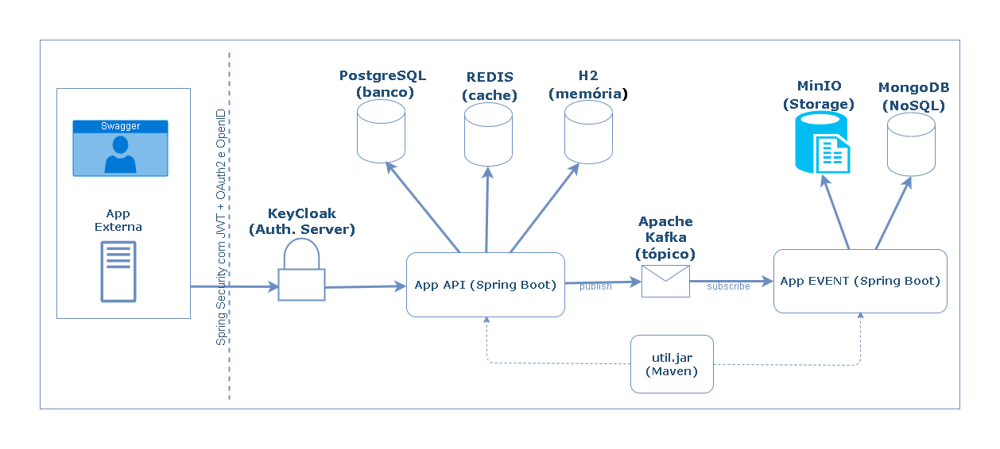

# 📘 App Demo ShowCase

[](https://github.com/ramiralvesmelo/app-demo/actions/workflows/maven.yml)
[](https://search.maven.org/artifact/org.springframework.boot/spring-boot-starter)
[](https://adoptium.net/)
[](https://spring.io/projects/spring-boot)
[](https://app.codecov.io/gh/ramiralvesmelo/app-demo)
[](https://sonarcloud.io/dashboard?id=ramiralvesmelo_app-demo)
[](https://sonarcloud.io/dashboard?id=ramiralvesmelo_app-demo)
[](https://sonarcloud.io/dashboard?id=ramiralvesmelo_app-demo)
[](https://sonarcloud.io/dashboard?id=ramiralvesmelo_app-demo)
[](LICENSE)

_**badges referentes ao projeto original_

---

# 📘 Sobre o Projeto

O **app-demo** é uma aplicação de demonstração que simula um sistema **ERP (Enterprise Resource Planning)** em pequena escala. Ele foi desenvolvido como base de estudos e treinamentos, oferecendo uma arquitetura modular e integrando diversos recursos práticos do ecossistema Java e Spring Boot.



* **Arquitetura ERP simplificada** — módulos de clientes, pedidos e produtos, cobrindo fluxo básico de um sistema de gestão.
* **Persistência de dados** — implementada com **JPA/Hibernate**, utilizando **PostgreSQL** (produção) e **H2** (ambiente de testes).
* **Mensageria assíncrona** — integração com **Apache Kafka** para publicação e consumo de eventos, como finalização de pedidos.
* **Cache distribuído** — uso de **Redis** para otimizar acessos e reduzir carga em consultas repetitivas.
* **Autenticação e Autorização** — baseada em **Keycloak**, com suporte a OAuth2/OpenID Connect.
* **APIs RESTful** — endpoints expostos para CRUD de entidades e fluxo de negócios (ex.: criação de pedidos).
* **Testes Automatizados** — cobertura com **JUnit 5** e **Mockito**.
* **Monitoramento** — suporte ao **Spring Actuator**, permitindo verificar métricas e saúde da aplicação.

---

## ⚙️ Pré-requisitos

* [Docker](https://www.docker.com/) MCP CLI v0.16.0 ou superior

---

## 🚀 Como Inicializar o Projeto

Para facilitar o processo de desenvolvimento, utilize os comandos abaixo com o **Docker Compose** já configurado em `infra/docker/docker-compose.yml`:

```bash
# 🟢 Subir todos os serviços em segundo plano
docker compose -f infra/docker/docker-compose.yml up -d

# 🔴 Derrubar todos os serviços e containers
docker compose -f infra/docker/docker-compose.yml down

# 📜 Visualizar logs do container principal da aplicação
docker compose -f infra/docker/docker-compose.yml logs -f app-demo
```

---

## 🛢️ Modelo de Dados e Estrutura de Entidades

O modelo de dados da aplicação foi desenhado para refletir um fluxo simplificado de **ERP**, abrangendo as principais entidades de negócio:

* 👥 **Clientes** — informações cadastrais de clientes.
* 📦 **Produtos & Estoque** — catálogo de produtos com controle de disponibilidade.
* 🛒 **Pedidos & Vendas** — registro de pedidos, itens e totalização.

### 📊 Diagrama Entidade-Relacionamento (MER)


O diagrama acima representa a relação entre as entidades principais, incluindo chaves primárias e estrangeiras que garantem integridade referencial.

### 🔗 Conexão com o Banco de Dados

* **URL JDBC:** `jdbc:postgresql://localhost:5432/appdb`
* **Usuário:** `appuser`
* **Senha:** `appuser`

> 💡 **Dica:** para inspecionar o banco, você pode utilizar ferramentas como **DBeaver** ou **pgAdmin**, conectando-se com as credenciais acima.

---

## 🔑 Segurança com Keycloak

### 📍 Configuração do Host (Windows/Linux)

Para acessar o **Keycloak** pelo **nome do serviço** `keycloak` a partir do **host**, adicione a entrada no arquivo *hosts* do sistema:

```text
127.0.0.1   keycloak
```

**Caminhos dos arquivos de hosts:**

* 🪟 **Windows:** `C:\Windows\System32\drivers\etc\hosts`
* 🐧 **Linux:** `/etc/hosts`

> 📌 Observação: dentro da **rede do Docker Compose**, o DNS já resolve `keycloak`. O ajuste acima é apenas para o **host** conseguir acessar `http://keycloak:8081/` (útil quando o *issuer* do token ou a documentação referem-se a `keycloak:8081`).

---

### ➡️ Console de Administração

* **URL:** [http://keycloak:8081/](http://keycloak:8081/)
* **Usuário:** `admin` 
* **Senha:** `admin` 

---

## 📨 Mensageria com Kafka

* **`app.kafka.topic.order-finalized`** → Nome do **tópico Kafka** onde serão publicadas as mensagens de pedidos finalizados.
  Exemplo: sempre que um pedido é concluído, uma mensagem é enviada para esse tópico.

* **`spring.kafka.consumer.group-id`** → Identificador do **grupo de consumidores**.
  Todos os consumidores com o mesmo `group-id` compartilham a carga das mensagens do tópico.
  Isso garante **paralelismo** e **balanceamento** — cada mensagem é entregue para apenas um consumidor dentro do grupo.

### 🌐 Interface de Visualização

* **Kafka UI:** [http://localhost:8083/ui/](http://localhost:8083/ui/)

Acesse para visualizar:

* 📋 Lista de tópicos disponíveis
* 📦 Mensagens enviadas e recebidas
* 👥 Grupos de consumidores ativos e seus offsets

---

#### 🌐 Rest API Collection de Endpoints 

👉 [Baixar `app-demo-collection.yaml`](./infra/insonia/app-demo-collection.yaml)

**Como importar:**

1. Abra o **Postman** ou **Insomnia**
2. Clique em **Import > File**
3. Selecione o arquivo `app-demo-collection.yaml`

> 💡 Na **collection do Postman** já existe a requisição pronta para obter o token.
> O passo a passo manual abaixo é útil para entender e testar via **curl**.

---

### 🖥️ Exemplo via **cURL** (Linux/macOS)

```sh
export TOKEN=$(curl -s \
  -d "client_id=app-demo-api" \
  -d "username=appdemo" \
  -d "password=123" \
  -d "grant_type=password" \
  http://keycloak:8081/realms/app-demo/protocol/openid-connect/token | jq -r .access_token)

echo $TOKEN

# Teste de requisição (resposta 200 se autenticado)
curl -s -H "Authorization: Bearer $TOKEN" http://keycloak:8080/api/products
```

### 🖥️ Exemplo via **PowerShell** (Windows)

```powershell
$body = @{
  client_id  = "app-demo-api"
  username   = "appdemo"
  password   = "123"
  grant_type = "password"
}

$TOKEN = (Invoke-RestMethod -Method Post `
  -Uri "http://keycloak:8081/realms/app-demo/protocol/openid-connect/token" `
  -ContentType "application/x-www-form-urlencoded" `
  -Body $body).access_token

# Teste de requisição (resposta 200 se autenticado)
Invoke-RestMethod -Method Get `
  -Uri "http://keycloak:8080/api/products" `
  -Headers @{ Authorization = "Bearer $TOKEN" }
```

---

## 📊 JMeter – Testes de Carga

```sh
# Linux
rm -rf /temp/jmeter/
mkdir -p /temp/jmeter/

# Windows
Remove-Item -Recurse -Force "/temp/jmeter"
New-Item -ItemType Directory -Path "/temp/jmeter"

# Executar plano de teste
jmeter -n -t post-customers-10000-random.jmx \
  -l /temp/jmeter/results.jtl \
  -e -o /temp/jmeter/report
```
---

## 🔄 Integração Contínua (CI/CD)

### Workflows em `.github/workflows`

* ⚙️ **Build** → Compila e empacota o projeto (Maven).
* 🧪 **Testes** → Executa a testes unitários e integração na suíte automatizada (JUnit 5 + Mockito).
* 🩺 **Check Health** → Exibe, por meio de badges, a saúde do projeto (Sonar + Codecov).
* 📦 **Publicação** → Publica o artefato no GitHub Packages.

### Integrações principais

* 📊 **Cobertura de testes no Codecov** → Ajuda a identificar partes críticas ainda sem testes, apresentando a porcentagem de código testado.
* ☁️ **Análise contínua no SonarCloud** → Detecta problemas e mantém padrões de qualidade analisando: bugs, vulnerabilidades e duplicidade.
* 📦 **Publicação de pacotes no GitHub Packages** → Facilita reuso e compartilhamento em outros projetos armazenando versões dos artefatos do projeto.
* 📈 **Dependency Graph** → Aumenta a visibilidade e permite detectar riscos em bibliotecas externas de forma automática.
* 📄 **SBOM (CycloneDX)** → Fornece rastreabilidade e suporte à auditorias de segurança, criando inventário dos componentes.
* 🚨 **Dependabot Alerts** → Alerta automatico monitorando e comunicando vulnerabilidades conhecidas em dependências.
* 🏷️ **Badges** no README → Comunicação clara e imediata para a equipe e comunidade com indicadores visuais de saúde do projeto.

---

## 🌱 Fluxo de Branches (GitFlow)

Adotamos o **GitFlow** para organizar entregas e paralelizar trabalho com segurança:

* **`main`**: linha de produção (somente `releases` e `hotfixes` versionados).
* **`develop`**: linha de desenvolvimento contínuo (base para `features`).
* **`feature/*`**: novas funcionalidades ou melhorias curtas, criadas a partir de `develop`.
* **`release/*`**: preparação de versão; estabilização e ajustes finais, criada a partir de `develop`.
* **`hotfix/*`**: correções urgentes em produção, criadas a partir de `main` e integradas de volta em `main` e `develop`.

---

### 🗺️ Gráfico (GitFlow)


---

### 📌 Legenda

| Branch       | Função                                                                        |
| ------------ | ----------------------------------------------------------------------------- |
| **main**     | Produção, recebe merges de `release` e `hotfix` com **tags** de versão        |
| **develop**  | Desenvolvimento contínuo, recebe merges de `features`, `release` e `hotfix`   |
| **feature/** | Desenvolvimento de novas funcionalidades a partir de `develop`                |
| **release/** | Preparação de versões, testes e ajustes finais antes de ir para `main`        |
| **hotfix/**  | Correções urgentes criadas a partir de `main`, voltam para `main` e `develop` |

---

## 🗂️ Estrutura do Projeto

```text
app-demo/
├── .github/                               		# Configurações do GitHub
│   └── workflows/                         		# Actions (CI)
│       └── maven.yml                      		# Pipeline Maven (build, testes, etc.)
├── infra/                                 		# Infra local e ferramentas
│   ├── docker/                            		# Docker / Compose da stack
│   │   ├── docker-compose.yml             		# Subir app + dependências (Postgres, Kafka, Redis, Keycloak)
│   │   └── Dockerfile                     		# Imagem da aplicação (JDK 21)
│   ├── insonia/                           		# Coleções do Insomnia
│   │   └── app-demo-collection.yaml       		# Requests prontos (inclui auth)
│   ├── jmeter/                            		# Testes de carga/performance
│   │   └── post-customers-10000-random.jmx		# Script exemplo JMeter
│   └── keycloak/                          		# Realm e dados do Keycloak
│       └── realms/		
│           ├── app-demo-realm.json        		# Realm com clients/roles/flows iniciais
│           └── h2/                        		# Base H2 do Keycloak (modo DEV)
├── src/
│   ├── main/
│   │   ├── java/
│   │   │   └── br/com/springboot/appdemo/ 		# Código-fonte principal
│   │   │       ├── Application.java       		# Classe bootstrap Spring Boot
│   │   │       ├── config/                		# Configurações (Security, Kafka, Transação, Web, etc.)
│   │   │       ├── controller/            		# REST Controllers
│   │   │       ├── exception/             		# Exceções de negócio e handler global
│   │   │       ├── message/               		# Eventos e integração (Kafka)
│   │   │       ├── model/                 		# DTOs e Entidades JPA
│   │   │       ├── repository/            		# Repositórios (interfaces + impl custom)
│   │   │       ├── service/               		# Interfaces e serviços (impl)
│   │   │       └── util/                  		# Utilitários (email, número de pedido, segurança)
│   │   └── resources/		
│   │       ├── application.properties     		# ⚙️ Config padrão (perfil default)
│   │       ├── application-docker.properties 	# ⚙️ Config para perfil `docker`
│   │       ├── schema.sql                 		# DDL inicial (dev/test)
│   │       └── data.sql                   		# Dados de exemplo (dev/test)
│   └── test/		
│       ├── java/                          		# Testes unitários/integração
│       └── resources/
│           └── application-test.properties		# Config de testes
├── .dockerignore
├── .gitignore
├── pom.xml                                		# Projeto Maven
└── README.md                              		# Este arquivo
```

---

## 📜 Licença

Distribuído sob a licença **MIT**.  
Sinta-se livre para usar, modificar e compartilhar.